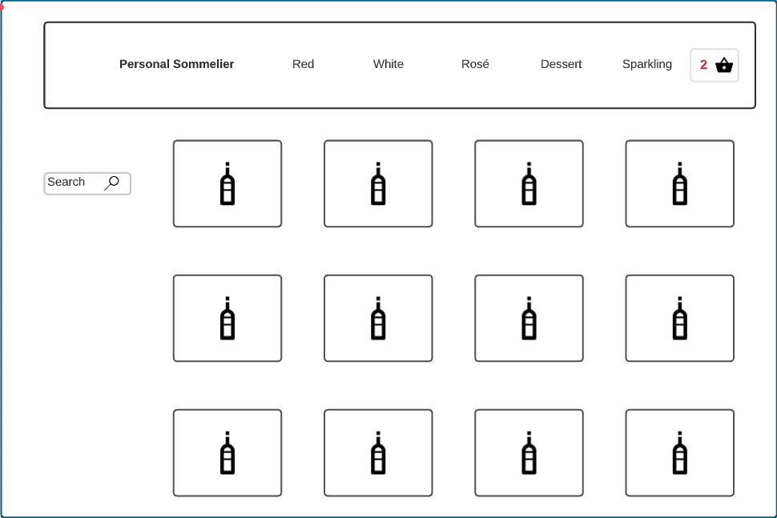
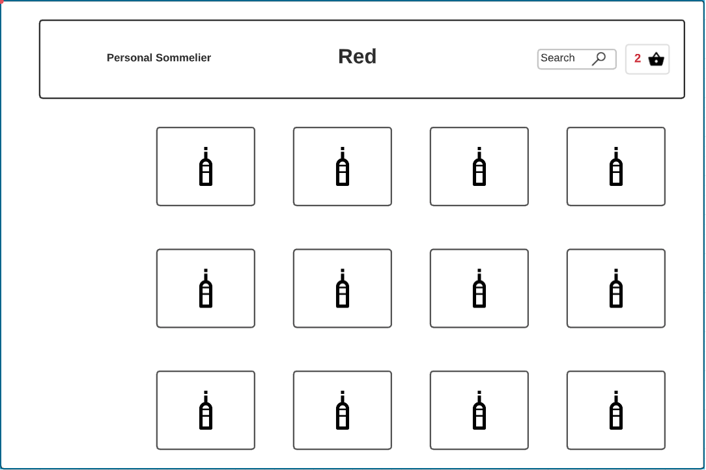
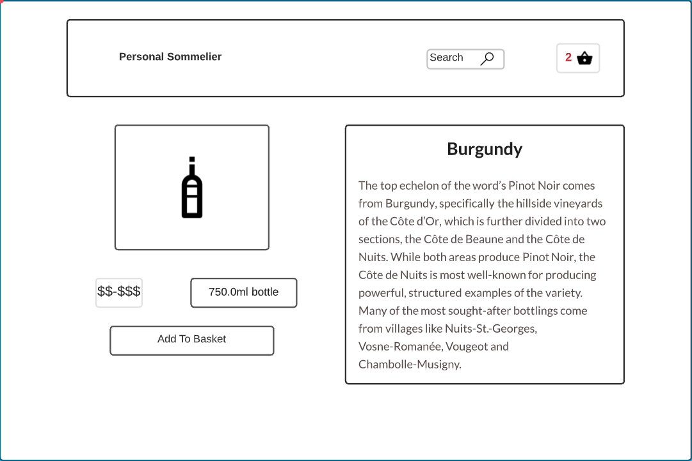
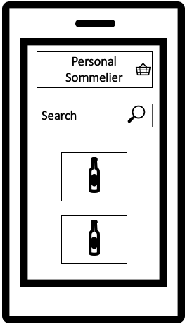
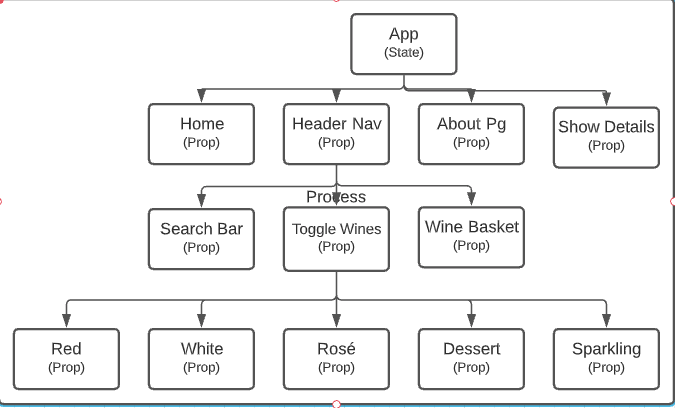
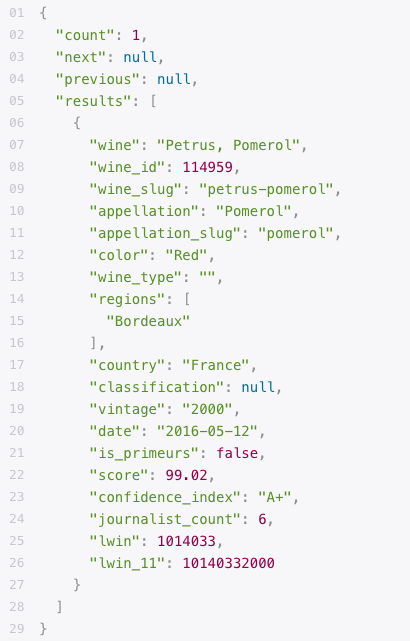

# **Project 4 Proposal**

## Project Description
    This app is an amazing tool that suggest wine based on the users special taste. Once deciding on a popular flavor the app will render a list of wines varying in prices for the user. The user will be able to click or touch on a image to learn more about that specific bottle. This app is for anyone over the age of 21 interested in exploring different flavors.

## Wire Frames
---

## Component Hierarchy
---

## Api 
---
[Global Wine Score](https://globalwinescore.docs.apiary.io/#introduction/quick-search-interface)

## Users Stories
---

### MVP Goals
- As a user, Id like to be able to view wines based off of the type.
- As a user, Id like to be able to search for a specific wine.
- As a user, Id like to be able to click or touch on a wine and see facts about that wine.
### Stretch Goals
- As a user, Id like to login to the app.
- As a user, Id like to be able to put wine into my "basket"
- As a user, Id like to be able to save wine to a "wish list".
- As a user, Id like to be able to view a quality rating based off of the sites analytics.